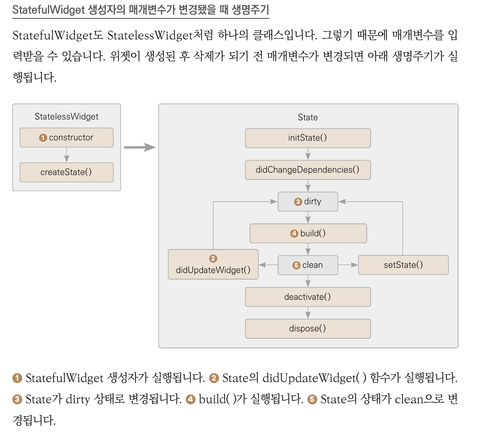
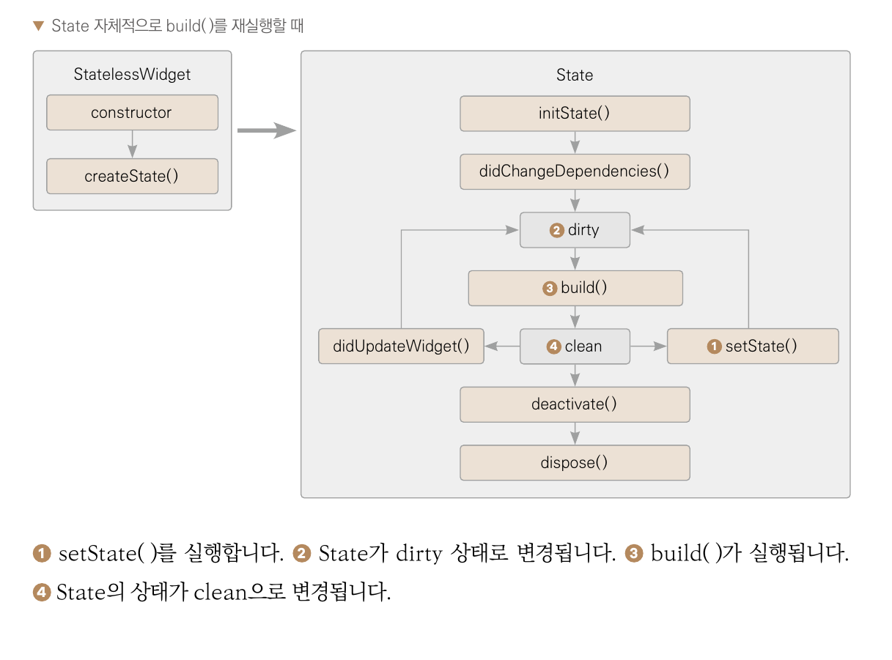

# image_carousel

## 완성 스크린샷

Chapter-08
전자액자
	위젯 생명주기, PageView, Timer, SystemChrome, StatefulWidget

	-학습 목표
	    이미지 5개를 롤링해보여주는 액자 앱을 만듭니다. 좌우 스와이프해 이미지를 변경할 수 있습니다.
	    7장에서 콜백 함수를 이용해서 특정 이벤트가 일어났을 때 함수를 실행했습니다. 이번에는 특정 주기마다 반복적으로 
	    함수를 실행하는 방법을 알아 보겠습니다.
	    

	-학습 마무리(요약)
	    1. StatlessWidget은 상태 관리가 필요 없을 때 사용합니다. 하나의 클래스로 이루어졌고, 
	    build() 함수는 생명주기 동안 단 한 번만 실행 됩니다.
	    2. StatefulWidget은 상태 관리가 필요할 때 사용합니다. StatefulWidget 클랙스와 State 클래스로
	    이루어졌고 생명주기 동안 build() 함수가 여러번 실행될 수 있습니다.(샐행 해보니 그런거 같지는 않음)
	    3. PageView 위젯을 이용하면 스와이프로 페이지를 변경하는 UI를 쉽게 구현할 수 있습니다.
	    4. Timer.periodic()을 이용해서 PageView를 조작할 수 있습니다.
	    5. PageController를 사용해서  PageView를 조작할 수 있습니다.
	    6. StatefulWidget의 initState()에 코드를 작성하면 State가 생성될 때 딱 한 번만 실행합니다.
	    7. SystemChrome.setSystemUIOverlayStyle을 사용해서 상태바의 색상을 흰색이나 검정색으로 
	    변경할 수 있습니다.

	    8.1 사전 지석
	    8.1.1 위젯 생명주기

	    StatelessWidget
	    	상태 없는 위젯
	    	StatelessWidget 생성자() -> build() 
	    	한번 생성하고 나면 속성을 변경할 수 없다.

	    StatefulWidget
	    	상태 있는 위젯
	    	StatefulWidget 생성자() -> createState() 
	    	한번 생기기하고 나서 속성을 변경할 수 있다.	    	
## StatefulWidget 생성자 매개변수가 변경됐을 때 생명주기		

## State 자체적으로 build()를 재실행할 때 생명 주기	

	    8.1.2 Timer

	    	Timer는 특정 시간이 지난 후에 일회성 또는 지속적으로 함수를 실행합니다. 
	    	Timer.periodic(
	    		Duration(seconds: 3),  //1.주기
	    		(Timer timer) {},      //2.콜백 함수
	    	);

	    8.2 사전 준비
	    	이번 프로젝트에서 사용할 파일들을 내려받고 프로젝트에 등록하는 과정을 알아보겠습니다.

	    8.2.1 이미지 추가하기
	    	에셋은 프로젝트에서 사용되는 파일들을 의미합니다. 동영상, 이미지, 음악 파일 등 입니다.
	    	프로제트에 asset 디렉토리에 img 폴더를 생성하고 테스트 이미지를 넣습니다.

	    8.2.2 pubspec.yaml 설정하기
	    	assets:
	    	    - asset/img/

		8.2.3 프로젝트 초기화하기
			lib/main.dart 파일 내부에 아래와 같이 추가.
				import 'package:flutter/material.dart';
				import 'package:flutter/services.dart';
				import 'dart:async';

				void main() {
				  runApp(
				    MaterialApp(
				      debugShowCheckedModeBanner: false,
				      home: HomeScreen(),
				    ),
				  );
				}				
			lib/screen/home_screen.dart

		8.3 레이아웃 구성하기
			이번 프로젝트의 레이아웃은 좌우로 위젯을 스와이프할 수 있는 1.PageView 하나로 구성되어 있습니다.

		8.4 구현하기 
		8.4.1 페이지뷰 구현하기
			01. PageView는 여러 개의 위젯을 독단적인 페이지로 생성하고 가로 또는 세로 스와이프로 페이지를 넘길 수 있게 하는 위젯입니다.
			HomeScreen 클래스에 PageView 를 추가 하겠습니다.

		8.4.2 상태바 색상 변경하기
			상태바는 앱을  샐행 중에 핸드폰 배터리, 시간, 와이파이 연결 상태 등을 보여주는 영역입니다.
			SystemChrome.setSystemUIOverlayStyle(SystemUiOverlayStyle.light);

		8.4.3 타이머 추가하기
			Timer 클래스를 사용해서 액자가 자동으로 롤링되는 기능을 추가하겠습니다.
			Timer를 추가하려면 HomeScreen extends StatelessWidget -> StatefulWidget 로 변경해야 합니다.
			1. StatefulWidget 은 createState() 함수를 정의해야 하면 State흫 반환해줍니다.
			2. _HomeScreenState 클랙스는 먼저 생성한 StatefulWidget 클래스를 매개변수로 받는 State 클래스를 상속합니다.
				build() 함수는 State에서 정의 합니다.

			02 initState() 함수에 Timer를 등록하겠습니다.
				1. async 패키지를 불러와야 Timer 를 사용할 수 있음.